# LAMP PROJECT
This project covers: 
- Setting up a Linux environment.
-  Configuration of Apache Server
- Managing MySQL databases
- Writing PHP code for server-side functionality.
- Creating a Virtual Host for Website using Apache

This project documents the major LAMP stack components and their roles in web application in web application

## Connecting to EC2 using Putty
- Syntax: ssh -i private-key-name.pem ubuntu@Public-IP-address

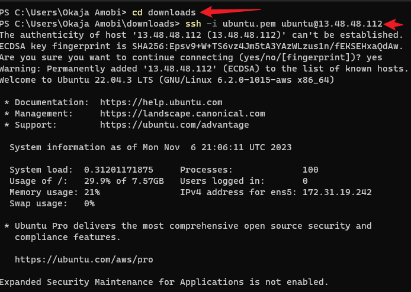

## STEP 1: Installing Apache and Updating Firewall
- Installation of apache using Ubuntu Package manager apt

Step 1: #update a list of packages in package manager using: sudo apt update

Step 2: #run apache2 package installation
$ sudo apt install apache2

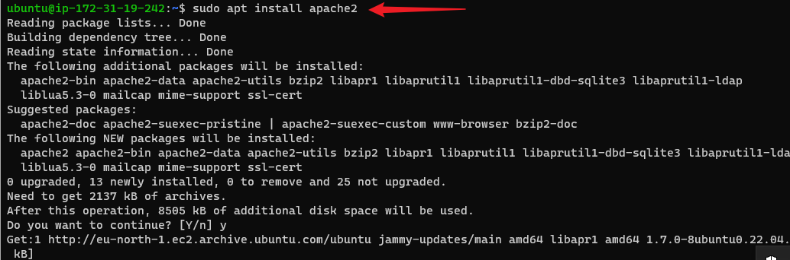

- Verify Apache2 is running: The green and running shows that our Apache Webserver has been launched in the clouds

Syntax: $ sudo systemctl status apache2

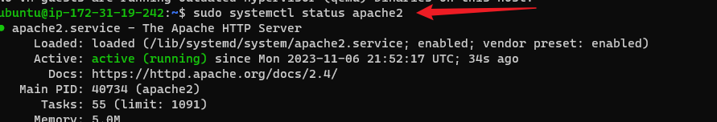

- Access Webserver Appache HTTP Server Locally

Syntax:  curl http://localhost:80
or
$ curl http://127.0.0.1:80

This can be accessed by using the curl command. We can either use the DNS name or the IP address

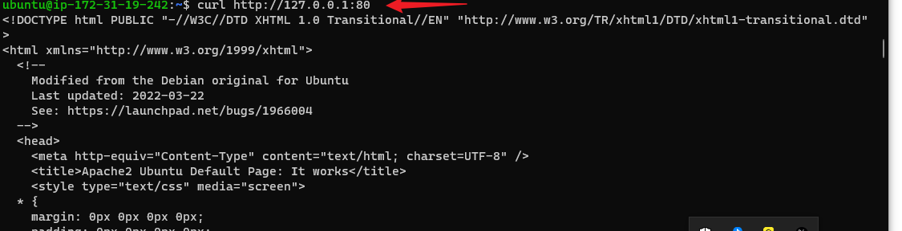

- Accessing the Apache HTTP Server via the internet

http://Public-IP_Address:80

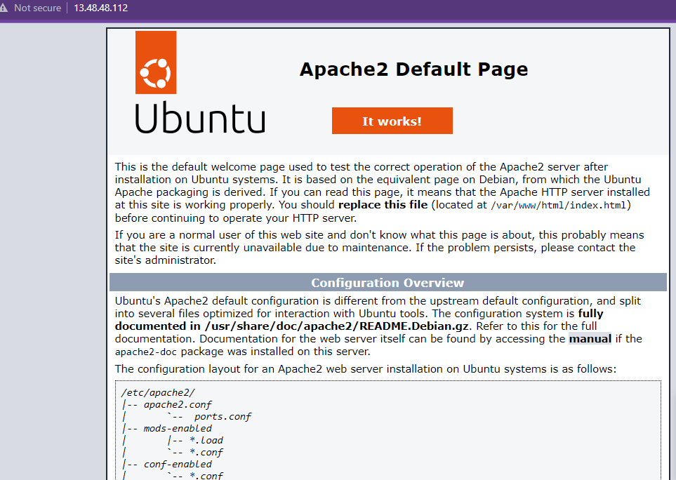

- Retrieve Public Address through the terminal.

Syntax: curl -s http://169.254.169.254/latest/meta-data/public-ipv4

Note that the port number 80 is not compulsory

## STEP 2: Installing MySql
 - Install mysql-server apt

 Syntax:  sudo apt install mysql-server

 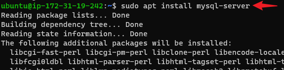

 - log in to Mysql console. The 'sudo' would connet to the MySQL server as the administrative database user root: 
 Syntax:  sudo mysql

 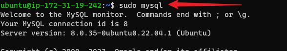

 - Run Security Script to remove some insecure default settings. Before running the script we set the password for the root user, using mysql_native_password as default authentication method. The new Password would be defined as PassWord.1

 ALTER USER 'root'@'localhost' IDENTIFIED WITH mysql_native_password BY 'PassWord.1';

 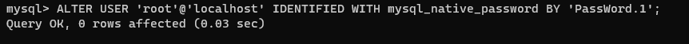

 To exit MySQL shell we use

 mysql> exit

 - Interactive Script

 syntax: sudo mysql_secure_installation

 When this script run, it would tell us to configure the VALIDATE PASSWORD PLUGIN. This feature if enabled would would ensure that passwords that didn't match the specified criteria will be rejected by MySQL with an error. It is safe to leave validation disabled, but strong unique passwords should be used for database credentials

 Login  using the syntax: sudo mysql -p

The -p would prompt for the password used after we changed the root user password

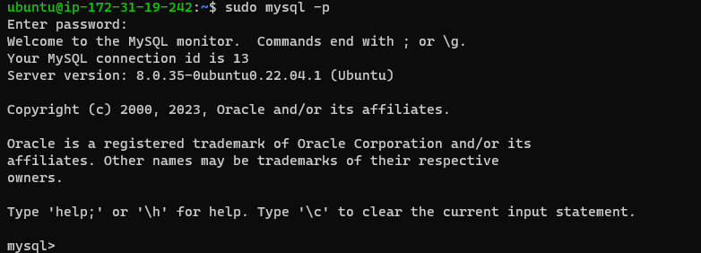

## STEP 3: Installing PHP
The PHP component is used to process code to display dynamic content to the end user. Aside the php package, we need the php-mysql- this module allows PHP to communicate with MySQL-based databases. The libapache2-mod-php is used to enable Apache to handle PHP files.

To install these 3 packages

- Syntax: $ sudo apt install php libapache2-mod-php php-mysql

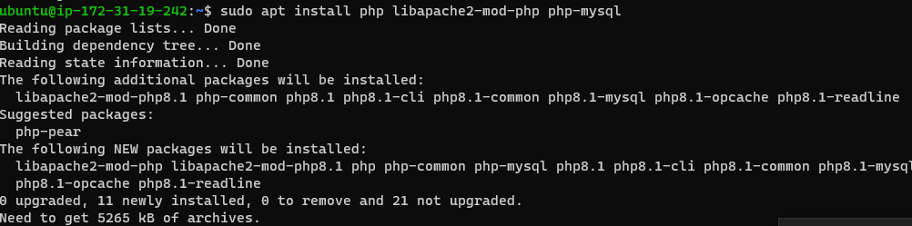

### Check the php version

- Syntax: php -v

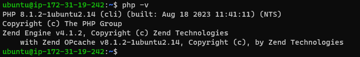

## STEP 4  Set Up Apache Virtual Host

An Apache Virual Host is used to hold website files and folders. Virtual host allows users have multiple website located on a single machine and users of the website will not even notice

### Enable PHP on the website
The DefaultIndex settings on Apache, has a file named index.html which always take precedence over index.php. The index.html file is used for creating a temporary file containing an informative message to visitors. To change index.html from been the landing page we edit the **/etc/apache2/mods-enabled/dirconf** file

- syntax: sudo vim /etc/apache2/mods-enabled/dir.conf

Add the code below in to the file:

<IfModule mod_dir.c>
        #Change this:
        #DirectoryIndex index.html index.cgi index.pl index.php index.xhtml index.htm
        #To this:
        DirectoryIndex index.php index.html index.cgi index.pl index.xhtml index.htm
</IfModule>

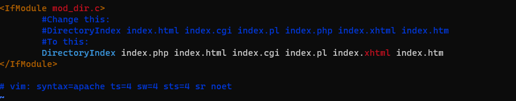

Save the file and reload Apache

### Reload Apache:

- Syntax: $ sudo systemctl reload apache2

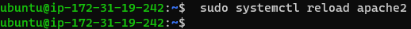

###  Test that PHP is correctly installed and configured on your server
 
 - Create File index.php

 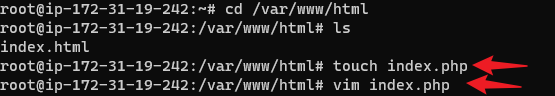

 After creating file and type in the php script below to enable us test page:

 
phpinfo();

When the page is refreshed in our web browser it displays the page below:

 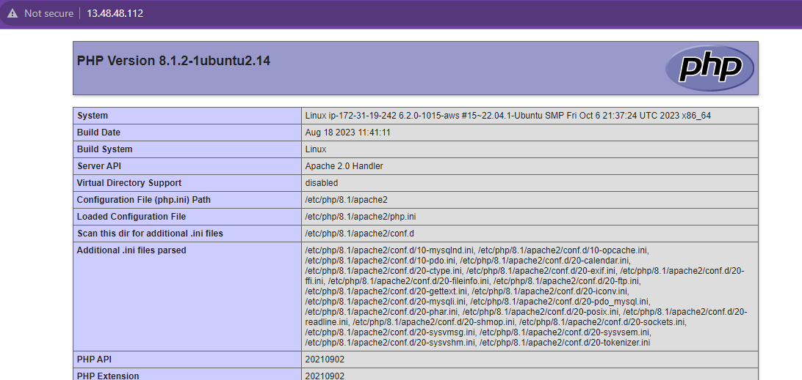

 The page provides information about our server from the perspective of PHP. It enables us debugg and also help to ensure that our settings are being applied correctly. This file would be removed because of the sensitive information it contains. This is shown in diagram belos

 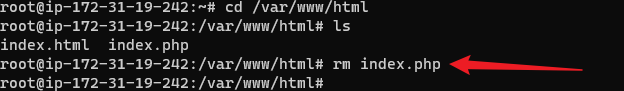

 ## STEP 5: Creating a Virtual Host for Website using Apache

 ### Set Up domain callled projectlamp

 Apache on Ubuntu 20.04 has a server block which is enabled by default that is configured to serve documents from the **var/www/html** directory. Folder projectlamp would be added to the www directory

 - syntax: $ sudo mkdir /var/www/projectlamp

 - The next step is to assign ownership of the directory with the $USER environment variable, this references the current system user

 - Create a configuration file in Apache's site-available direcory and input the code below:
<VirtualHost *:80>
    ServerName projectlamp
    ServerAlias www.projectlamp 
    ServerAdmin webmaster@localhost
    DocumentRoot /var/www/projectlamp
    ErrorLog ${APACHE_LOG_DIR}/error.log
    CustomLog ${APACHE_LOG_DIR}/access.log combined
</VirtualHost>

-To view the new configuration file creage we us the ls command.

All these commands are shown in the image below

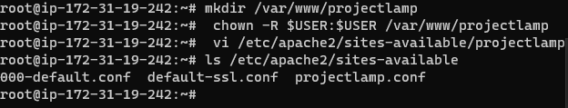

With the  VirtalHost configuration, Apached would serve projectlamp using **/var/www/projectlampl** as its web root directory. To ensure that the Domain name is not used to test the page we comment out the ServerName and ServerAlias options 

- Enable Virtual Host 

syntax: $ sudo a2ensite projectlamp

- To Test that the config File

-syntax $ sudo apache2ctl configtest

Reload Apache again to ensure that these changes

$ sudo systemctl reload apache2

-Test virtual host by creating file index.html and test 

- syntax: sudo echo 'Hello LAMP from hostname' $(curl -s http://169.254.169.254/latest/meta-data/public-hostname) 'with public IP' $(curl -s http://169.254.169.254/latest/meta-data/public-ipv4) > /var/www/projectlamp/index.html

#### To open website URL using IP address
- http://Public-IP-Address:80

#### To open website URL using DNS

http://Public-DNS-Name:80

